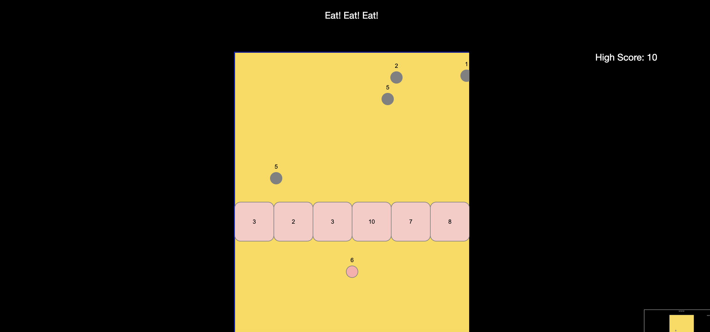
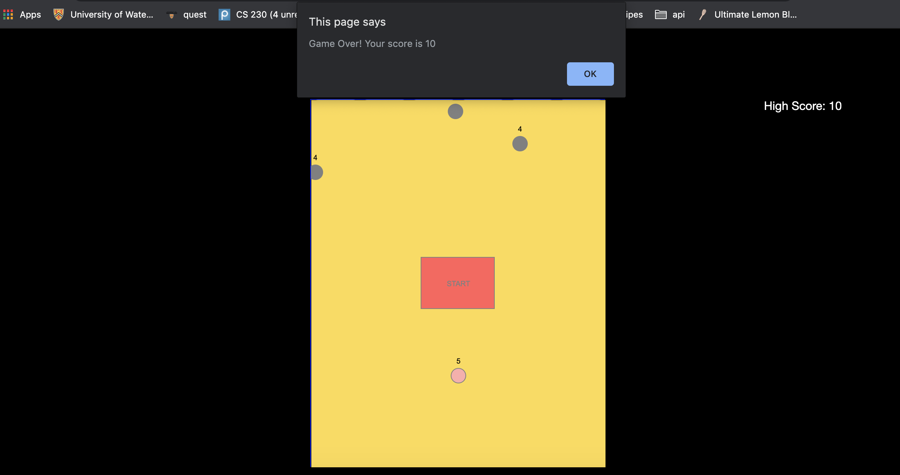

# EatEatEat!

A web game created with Javascript for the final project for NM2207 - Computational Media taken at the National University of Singapore. The goal of the game is for the player to obtain the highest score possible, achieved by destroying the obstacles. The player obtains more "lives" by collecting the circles with a score on it. The player can only pass through the obstacle if their current score exceeds the obstacle score. The obstacle's score is added to the player's total score as it is destroyed.

